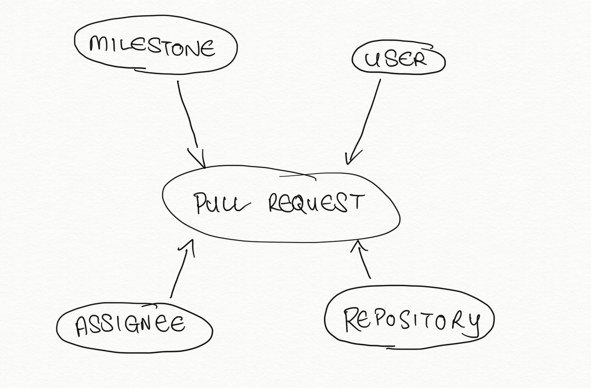
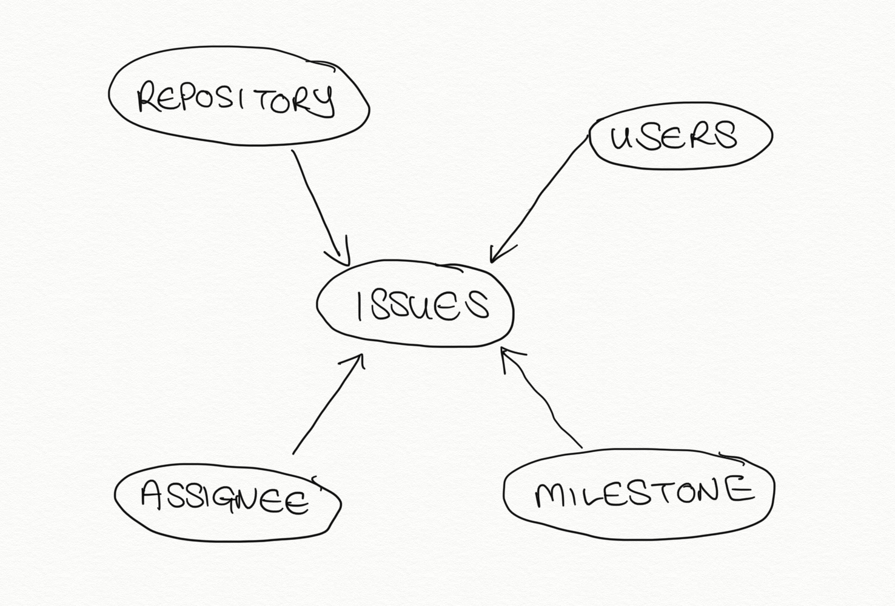

# netlify-github

Job application question around Netlify GitHub Dimensional Model

## Question

At Netlify, we use a very common GitHub issues workflow with code changes in Pull Requests against any Repo in our Organization. Assume we used the GitHub Singer Tap to extract data into the warehouse, please link to a Google Slide or screenshot with the diagram of a dimensional model in the tool of your choice.

## Assumptions

* The facts that we are trying to interested in are:
  * Pull Requests
  * Issues
* We are only able to use the GitHub Singer Tap for access to the GitHub API (restricting us from the full API)
* We can do some data transformation before inserting to Database (to better fufill the model)

## Pull Requests

## Issues

This could be extended to include Teams too

